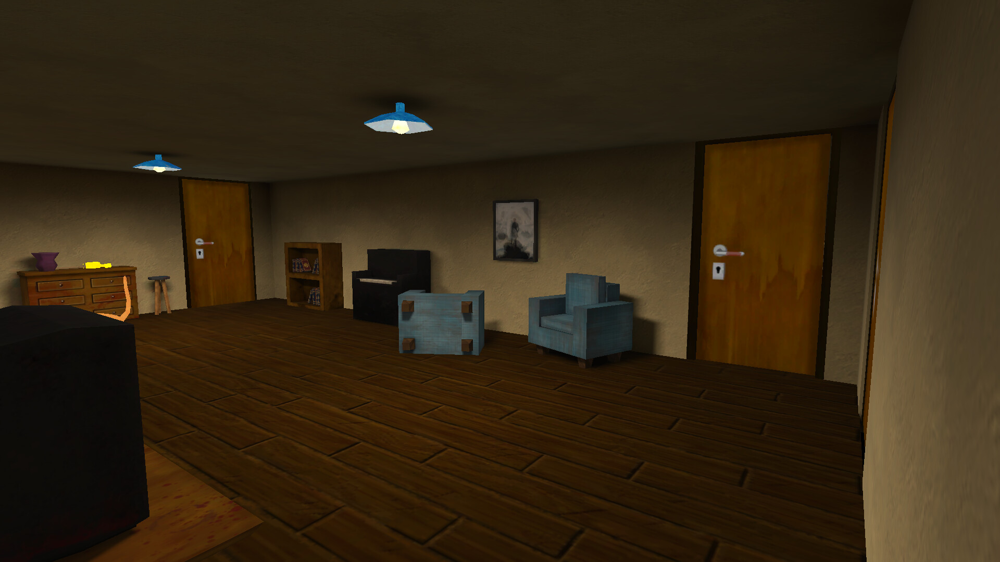
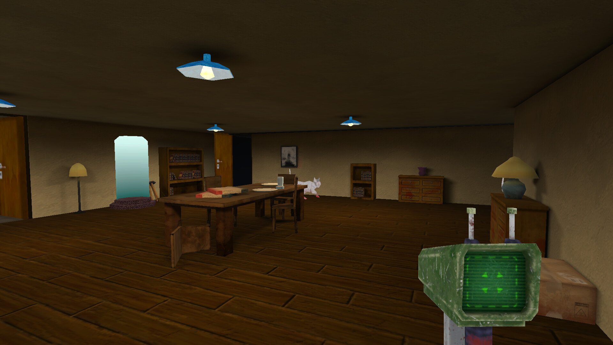
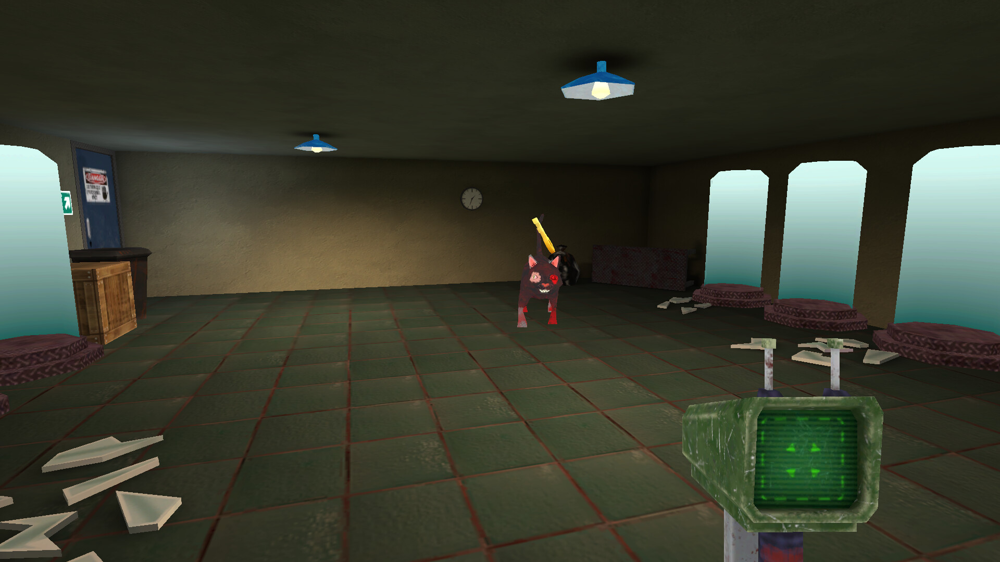

# Honey I'm Home!

[Published game](https://abelst.itch.io/honey-im-home)

[Gameplay video](https://youtu.be/9_8Cu_TotNk)

## In-Game Images

## Overview
This RPG horror survival game was developed by a team of four, with each member responsible for a specific department. The project was an original concept created as part of my video game concentration. Our goal was to produce a vertical slice of the first level and publish it on itch.io.

My primary role focused on **programming**. The project was developed using **Unity** and **C#** in **Visual Studio**.

## Game Features
- Player movement and controls  
- Enemy AI behavior  
- Core gameplay mechanics  
- UI implementation and objectives menu  
- Camera movement  
- Generic audio script
- Enemy Animations
- Player has a type of weapon   

## Development Requirements
The game was developed within one month, prioritizing functionality and delivery speed over optimization.

